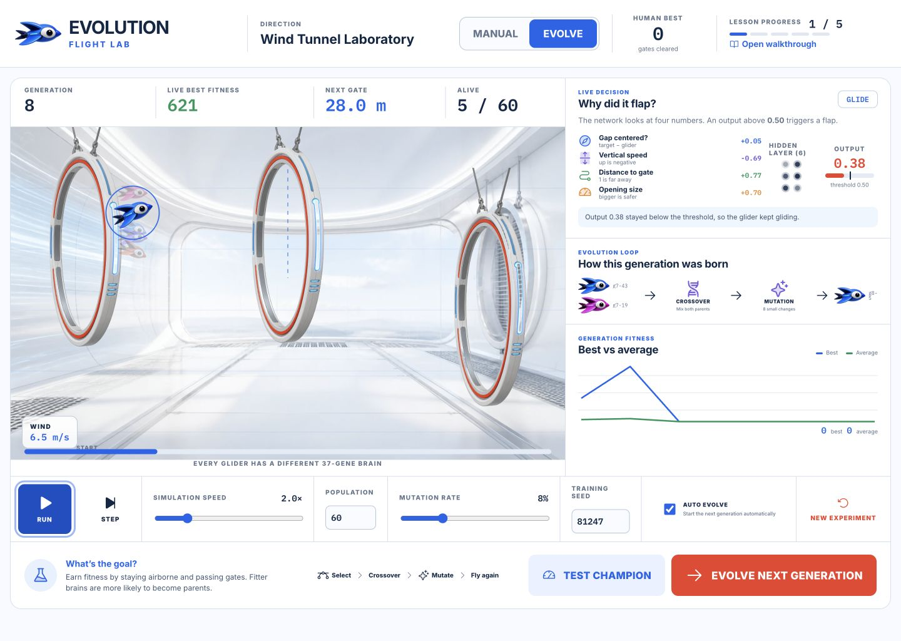

# Evolution Flight Lab

Evolution Flight Lab is a playable, visual introduction to neuroevolution. First, you fly an original micro-glider through suspended research gates. Then you switch to the lab and watch a population of tiny neural networks evolve the same skill.

The project is designed for complete beginners. Every important part of the algorithm remains visible: what the champion senses, how its network decides to flap, how fitness is calculated, and how selection, crossover, and mutation create the next generation.



## What you can do

- **Play manually** with Space, click, or touch and establish a human benchmark.
- **Watch evolution live** with up to 200 neural-network-controlled gliders.
- **Pause and step** through individual physics frames.
- **Change the experiment** by adjusting population, mutation rate, simulation speed, and seed.
- **Inspect the champion** through live sensor readings, six hidden neurons, and the final flap probability.
- **Follow a child’s lineage** from selected parents through crossover and mutation.
- **Test generalization** by running the champion on a gate sequence it never saw during training.
- **Replay experiments** exactly with a seeded random-number generator.

All progress stays in your browser. There are no accounts, analytics, backend services, or network calls.

## Run locally

Requirements: Node.js 22 or newer and npm.

```bash
git clone https://github.com/santos-sanz/evolution-flight-lab.git
cd evolution-flight-lab
npm install
npm run dev
```

Open the local address printed by Vite.

## Start learning

1. Begin in **Manual** mode and clear as many gates as you can.
2. Switch to **Evolve** and watch generation one.
3. Follow the highlighted champion in the flight lane.
4. Read **Why did it flap?** to connect sensor inputs to the network output.
5. Compare best and average fitness as generations advance.
6. Change mutation from 8% to 0%, then to 25%, and observe the difference.
7. Use **Test champion** to run the best network on an unseen course.

For a deeper explanation, including diagrams, pseudocode, formulas, a glossary, and guided experiments, read [How it learns](docs/how-it-learns.md).

## The algorithm at a glance

Each glider has a `4 → 6 → 1` feed-forward neural network:

| Layer | Meaning |
| --- | --- |
| 4 inputs | Vertical offset, vertical velocity, distance to the next gate, opening size |
| 6 hidden neurons | Weighted combinations transformed with `tanh` |
| 1 output | A sigmoid probability; values above `0.50` trigger a flap |

The network has exactly 37 evolvable numbers: 24 input weights, 6 hidden biases, 6 output weights, and 1 output bias. Together, these numbers are the glider’s genome.

At the end of a generation:

1. Rank gliders by fitness.
2. Copy the four elites unchanged.
3. Select parents through tournaments of three.
4. Build each child with uniform crossover.
5. Mutate each gene with an 8% default probability.
6. Run the new population on the same seeded course.

Fitness rewards flight distance and gate clearance. Every glider in a generation sees the same course, making comparisons fair. The unseen-course test uses a separate seed to reveal whether a champion learned a reusable strategy.

## Project structure

```text
src/
  engine/          Deterministic physics, neural network, genetics, and RNG
  components/      Canvas renderer and explanatory interface panels
  App.tsx          Manual/evolution modes and orchestration
  persistence.ts   Versioned local checkpoint storage
docs/
  how-it-learns.md Beginner learning guide
tests/e2e/          Browser-level learning journey and responsive checks
```

The engine is deliberately independent from React and Canvas. It can run headlessly for deterministic tests and benchmarks.

## Quality checks

```bash
npm run lint
npm run typecheck
npm test
npm run test:e2e
npm run build
npm run test:sites
```

The test suite covers seeded courses, flight physics, collisions, scoring, neural inference, selection, crossover, mutation, elitism, checkpoints, UI flows, responsive layout, and a deterministic benchmark requiring the default population to clear at least three gates within 40 generations.

## Originality and asset policy

Evolution Flight Lab borrows only the broad one-button obstacle-flight mechanic common to many games. Its name, micro-glider character, suspended research gates, wind-tunnel setting, interface, and educational content are original. It does not include Flappy Bird artwork, green pipes, logos, sounds, or trade dress.

The included visual assets were generated specifically for this educational project. Interface icons come from [Phosphor Icons](https://phosphoricons.com/) under the MIT license. Inter and IBM Plex Mono are distributed under the SIL Open Font License.

## License

Code is available under the [MIT License](LICENSE).
